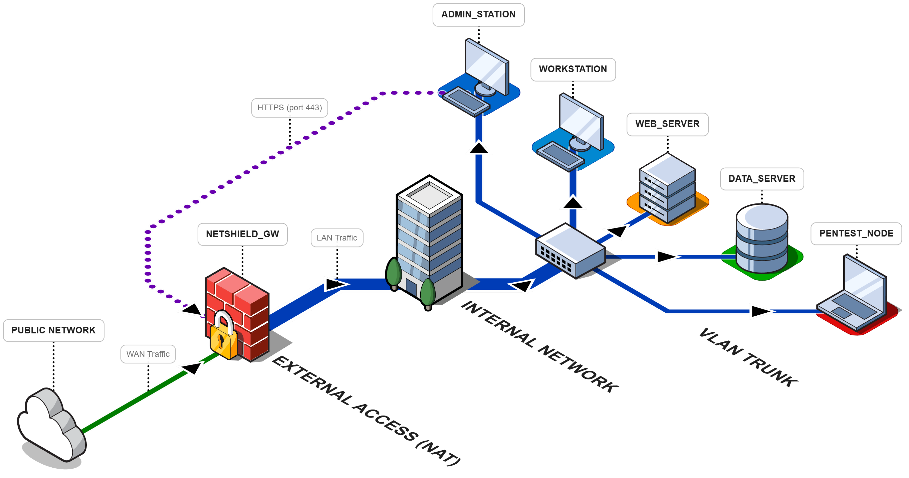

# Network Infrastructure Design, Securing & Security Audit
*A comprehensive Home Lab project focused on enterprise network segmentation, services deployment, and proactive security auditing.*

  

> For a detailed view of all interfaces and IP addresses, please refer to the **[Complete Topology](./diagrams/complete/network-topology-complete-transparent.png)**.

## 📌 Project Overview
This project simulates a modern enterprise infrastructure by integrating the fundamental principles of **Defense in Depth**. It features a fully virtualized environment managed by a **pfSense** firewall, acting as the central security gateway.

The lab was designed with a dual objective:
1. **Infrastructure Engineering**: Implementing 802.1Q VLAN segmentation, inter-VLAN routing, and critical services (DHCP, Web, Data).
2. **Security Auditing**: Simulating real-world attack vectors via Kali Linux to identify vulnerabilities and deploy effective remediation measures.

## 🏗️ Architecture & Topology
The infrastructure is organized into distinct logical zones to ensure strict isolation and control:

* **WAN**: External connectivity with NAT and firewalling.
* **MGMT (Management)**: Restricted zone for infrastructure administration.
* **USERS**: Dedicated segment for workstations with filtered internet access.
* **DMZ/SERVICES**: Hosting public-facing and internal services (Nginx Web Server).
* **STORAGE**: Isolated segment for centralized data management and Access Control Lists (ACLs).
* **OFFENSIVE ZONE**: Isolated segment for the `PENTEST_NODE` (Kali Linux) to simulate external or rogue internal threats.

> **Technical Diagrams**: The network diagrams in this repository are available in JSON format. You can view or edit them by importing the files into the **[fossFLOW](https://github.com/stan-smith/FossFLOW)** application.

## 🛡️ Security Implementation
* **Micro-Segmentation**: Logical separation via VLANs to prevent lateral movement.
* **Stateful Inspection**: Granular firewall rules on pfSense to regulate traffic between segments.
* **Hardening**: Service-level security, including intrusion prevention and access control.

## 🔍 Security Audit & Pentesting
The lab served as a sandbox for several attack and defense scenarios:
* **Reconnaissance**: Nmap stealth scanning to verify firewall rule efficiency and service exposure.
* **Exploitation**: Brute force attack simulations using `Hydra`.
* **Defense Analysis**: Implementation of security measures (e.g., Fail2Ban) and analyzing their impact on the attack surface.
* **Remediation**: Strengthening the global security posture based on audit findings.

## 🛠️ Technologies Used
* **Networking**: pfSense, 802.1Q VLANs, Static Routing, DHCP.
* **Security/Pentest**: Kali Linux, Nmap, Hydra, Fail2Ban.
* **Virtualization**: Oracle VM VirtualBox (Type 2 Hypervisor).
* **Diagramming**: fossFLOW.

## 📄 Full Project Report
For a deep dive into the technical configurations, firewall rules, and detailed audit results, read the full documentation here:
👉 **[View PDF Report](./Network_Security_Lab_Report.pdf)**